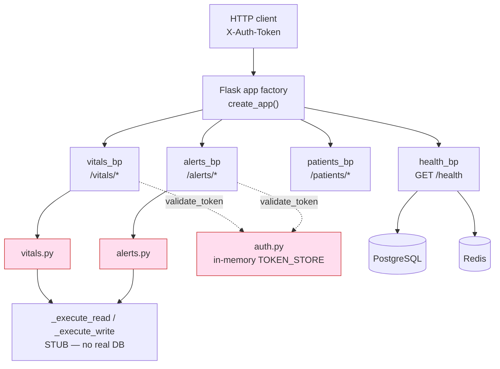
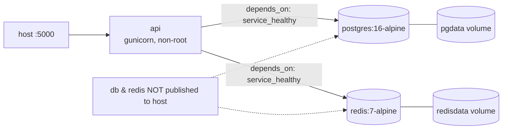
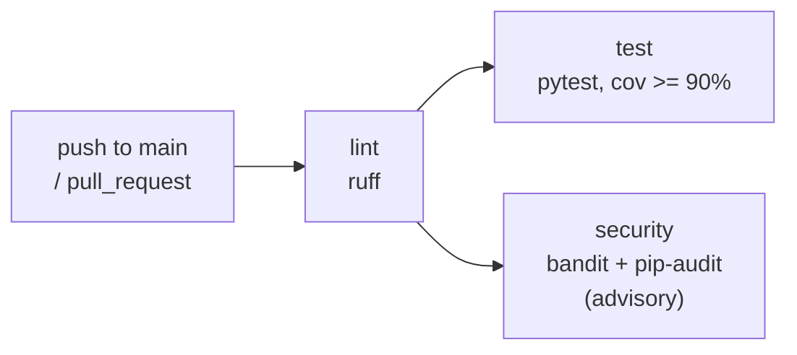

# Architecture

## System Overview

HealthTrack API is a Flask REST service for recording and retrieving patient
vital signs. It is a **teaching project**: the HTTP and service layers are real,
but the database access functions are **stubs** (`_execute_read`/`_execute_write`
return canned values) and the service modules carry intentional vulnerabilities.
The Week 6 work added containerisation, a CI/CD pipeline, and a real `/health`
probe that connects to live Postgres and Redis.

## Component Diagram

```
                         ┌─────────────────────────────────────────┐
   HTTP client ────────▶ │ Flask app  (create_app, app/__init__.py) │
   (X-Auth-Token)        │  registers 4 blueprints:                 │
                         │   health_bp   GET /health                │
                         │   vitals_bp   /vitals/*                  │
                         │   patients_bp /patients/*                │
                         │   alerts_bp   /alerts/*                  │
                         └───────────────┬──────────────────────────┘
                                         │ thin wrappers (app/routes.py)
                  ┌──────────────────────┼───────────────────────────┐
                  ▼                      ▼                            ▼
        app/vitals.py            app/alerts.py                 app/auth.py
        record/get/trend         active/ack/escalate           login / validate_token
                  │                      │                      (in-memory TOKEN_STORE)
                  ▼                      ▼
        _execute_read/_write  ◀── STUBBED (no real DB) ──▶  _execute_read/_write

        app/health.py ──(real connections)──▶  PostgreSQL  +  Redis
```

## Diagrams (Mermaid — renders on GitHub)

### Components & data flow


> Pink nodes carry the intentional teaching vulnerabilities. Only `/health` opens real DB/cache connections; the service layer is stubbed.

### Deployment (docker-compose)



### CI pipeline (gated jobs)



## Request Lifecycle (a protected write)

```
POST /vitals/{patient_id}
  → routes.post_vital()
      → _get_staff_id(request)         # reads X-Auth-Token, calls auth.validate_token
          → 401 if no valid session
      → vitals.record_vitals(...)      # builds SQL (f-string — intentional vuln), stub-writes
          → _check_alert_threshold()   # calculate_alert_threshold(); KeyError-safe
          → _fire_alert() if breached
  → 201 JSON {success, reading_id, alert}
```

## Deployment Topology (docker-compose)

```
        host :5000
            │
            ▼
   ┌────────────────┐     internal compose network (db/redis NOT published)
   │ api (gunicorn) │────────────────┬───────────────────┐
   │ non-root       │                ▼                   ▼
   │ wsgi:app       │          postgres:16-alpine    redis:7-alpine
   └────────────────┘          (pgdata volume)       (redisdata volume)
        startup gated by db/redis healthchecks (depends_on: service_healthy)
```

## Design Decisions

The full decision/cost log is in [TRADEOFFS.md](TRADEOFFS.md). Summary:

| Decision | Chosen Approach | Alternative | Rationale | Trade-off |
|----------|-----------------|-------------|-----------|-----------|
| App entry | `create_app()` factory + `wsgi.py` for gunicorn | run from `__init__` | Importing `app` for tests doesn't bind a server | Slight indirection |
| `/health` | Liveness, always 200, reports deps | Strict readiness (503) | Standalone container passes Part 2's 200 check | No status-code readiness signal |
| Image | Multi-stage, non-root, slim | Single-stage | Smaller image + smaller attack surface | Extra Dockerfile complexity |
| CI security | Advisory (`bandit`/`pip-audit` non-blocking) | Blocking | App ships intentional vulns; keep pipeline green | No hard block on new vulns |
| Deps | `requirements.txt` (runtime) + `requirements-dev.txt` | Single file | Lean production image | Two files to maintain |
| Startup ordering | `depends_on: service_healthy` | none / sleeps | api never races a half-started DB | Slightly slower `compose up` |

## Security Architecture

See [SECURITY.md](../SECURITY.md) and the
[threat model](threat-models/THREAT_MODEL_week6_cicd_docker.md). Key controls added
in Week 6: non-root container, internal-only db/redis, secrets via environment
(`.env`/GitHub secrets), and coarse `/health` output that never leaks internals.

> **Out of scope / known-weak:** the `app/vitals.py`, `app/auth.py`, `app/alerts.py`
> service modules contain intentional vulnerabilities (SQL injection, MD5, PII
> exposure) — see [LIMITATIONS.md](LIMITATIONS.md).
